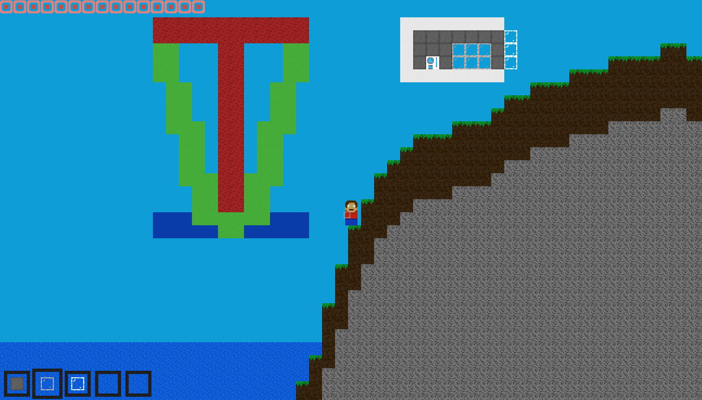

# OpenTiv2d

Tivect is a 2d free exploration web game: "singleplayer and multiplayer, PvP, PvE, build".
The goal of the OpenTiv2d project is to expand this freedom for players by finishing what [the original Tivect project](https://game.tivect.com) started: taking the base game and opening back up popular discontinued features while improving performance, accessibility, and customizability.



## Project History

From 2021 to 2023, [Tivect](https://game.tivect.com)'s developer served its small but dedicated community by adding beloved features such as vehicles, NPCs, and an unfinished energy system, as well as occasionally hosting a then-proprietary multiplayer server. However, in recent years development stopped in favor of a separate 3d renderer project.

Starting in Summer 2025, the developer kindly made the [source code for Tivect's game frontend](https://github.com/AMC-code/T2DG) and [multiplayer backend](https://github.com/AMC-code/T2DMPGS) available under the GNU GPLv3 license. This allowed the OpenTiv2d project to become fork of Tivect aimed at the above goals (see the roadmap below for specifics)

## Roadmap

1. Heavily refactor code, improve performance, and fix minor bugs
2. Improve customizability and accessibility (mobile controls, worldgen settings, customizable keyboard layouts, consistent menu UI/UX)
3. Add back popular removed features (NPCs, vehicles, storage boxes, loading saved worlds)
4. Restore multiplayer worlds, if possible?
5. Extend with new features to fulfill the Tivect mission (better worldgen, weapons system, overhaul multiplayer)

## Architecture

OpenTiv2d has inherited a complicated codebase architecture from the original Tivect developer, but the codebase is slightly modified to produce a monorepo.

Ideally, the project should be (may not currently be) structured like:
```
(repo folders and files like docs)

game/
    adminPanel/ (?)
    vehicle_builder_server/ (?)
    vehicle_builder/
    shared/
        styles.css
        game_constants.js
        textures/
            ...
multiplayer_server/
    server/
        (?)
```

Check `multiplayer_server/README.md` for instructions on starting a multiplayer server.

## Contribution

As mentioned above, a lot has been inherited from the original developer--this is a *very messy codebase*!
As a result, offering support to contributors is challenging.

With that said, anyone who wants to contribute can feel free to look through the code, fork to change things, and put in pull requests if desired.

Some advice is:
- Some major systems might need to be refactored, and that's okay
- Be careful searching through the codebase because many different variables and functions are named the same thing (will be working to improve this)
